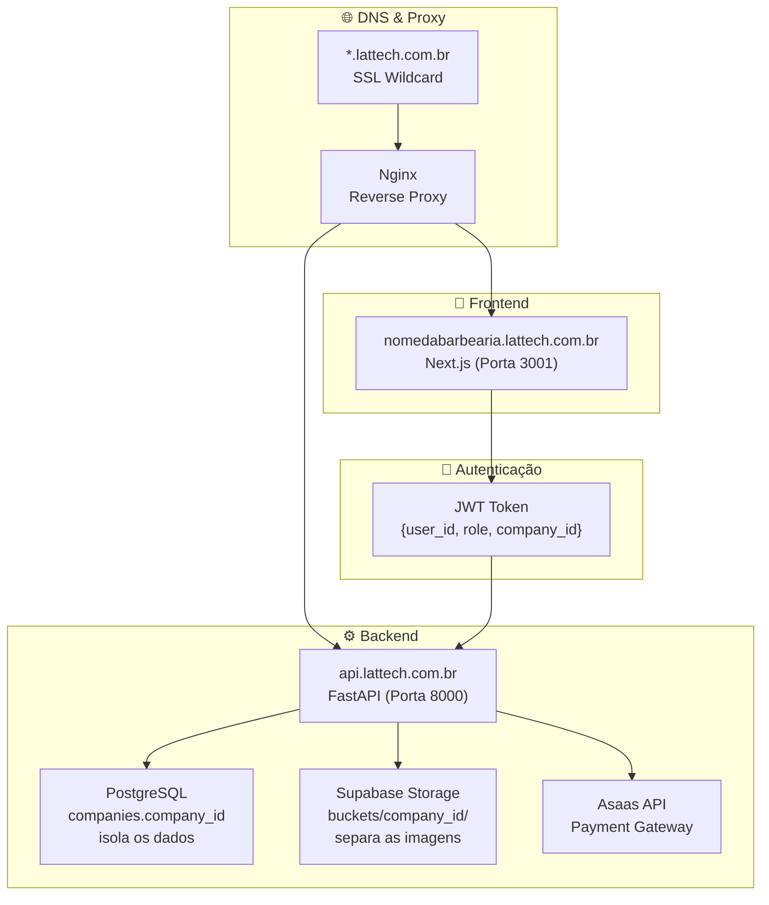
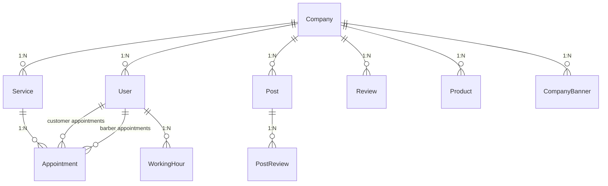

<div align="center">
  <br/>
  
  
  <br/><br/>

  <h1 align="center">
    ⚡ <strong>LAT System</strong>
  </h1>

  <p align="center">
    <strong>SaaS Multi-Tenant de Gestão para Barbearias</strong>
    <br />
    <em>Agendamento inteligente · Feed Social · Vitrine de Produtos · Comissões · Assinaturas</em>
  </p>

  <br/>

  <p align="center">
    <a href="#-visão-geral">Visão Geral</a> •
    <a href="#-stack-tecnológica">Stack</a> •
    <a href="#-arquitetura-multi-tenant">Multi-Tenant</a> •
    <a href="#-comunicação-frontend--backend">Comunicação</a> •
    <a href="#-funcionalidades">Funcionalidades</a> •
    <a href="#-infraestrutura">Infraestrutura</a>
  </p>

  <br/>
</div>

---

## 📋 Visão Geral

**LAT System** é uma plataforma SaaS completa para barbearias, construída com arquitetura **multi-tenant**. Cada barbearia (tenant) possui seu próprio subdomínio white-label (`nomedabarbearia.lattech.com.br`), painel administrativo completo e página pública de vitrine com agendamento online.

O sistema foi projetado para substituir planilhas, cadernos e múltiplos aplicativos desconexos, consolidando em uma única plataforma:

| Módulo | Descrição |
|---|---|
| 💈 **Agendamento Online** | Clientes agendam direto pela vitrine pública |
| 📊 **Dashboard Gerencial** | Métricas em tempo real, faturamento, top serviços |
| 👥 **Gestão de Equipe** | Cadastro de barbeiros e comissão fixa por corte |
| 📸 **Feed Social** | Portfólio de trabalhos com avaliações por post |
| 🏪 **Vitrine de Produtos** | Venda de produtos (shampoo, pomadas, etc.) |
| ⭐ **Avaliações** | Sistema de aprovação moderada pelo admin |
| 💳 **Assinaturas (Asaas)** | Planos mensais com trial grátis e cobrança recorrente |
| 🤖 **IA Conversacional** | Bot com DeepSeek para agendamento via chat |

---

## 🛠 Stack Tecnológica

### Backend

| Tecnologia | Versão | Propósito |
|---|---|---|
| **Python** | 3.12+ | Linguagem principal |
| **FastAPI** | 0.136 | Framework web (ASGI) |
| **SQLModel** | 0.0.38 | ORM (SQLAlchemy + Pydantic) |
| **PostgreSQL** | 15 | Banco de dados relacional |
| **JWT (python-jose)** | — | Autenticação stateless |
| **bcrypt (passlib)** | — | Hash de senhas |
| **httpx** | — | Cliente HTTP (Supabase API + Asaas) |
| **Uvicorn** | 0.47 | Servidor ASGI |

### Frontend

| Tecnologia | Versão | Propósito |
|---|---|---|
| **Next.js** | 16.2 | Framework React (App Router) |
| **React** | 19.2 | Biblioteca de componentes |
| **TypeScript** | 5 | Tipagem estática |
| **Tailwind CSS** | 4 | Estilização utility-first |
| **Lucide React** | 1.16 | Ícones |

### Infraestrutura

| Tecnologia | Propósito |
|---|---|
| **Docker** + **Docker Compose** | Containerização do backend + banco |
| **Nginx** (com SSL Wildcard) | Proxy reverso e TLS |
| **PM2** | Gerenciamento de processo do Next.js |
| **GitHub Actions** | CI/CD — deploy automático na VPS |

### Serviços Externos

| Serviço | Integração |
|---|---|
| **Supabase Storage** | Armazenamento de imagens (logos, posts, banners, produtos) |
| **Asaas** | Gateway de pagamento (assinaturas recorrentes) |
| **DeepSeek API** | Chatbot inteligente para agendamento |

---

## 🏗 Arquitetura Multi-Tenant

### Estratégia de Isolamento

O LAT System adota o modelo **discriminator column**: uma coluna `company_id` em todas as tabelas isola os dados de cada barbearia.



### Identificação do Tenant

| Camada | Método | Detalhes |
|---|---|---|
| **DNS** | Subdomínio | `mariobarber.lattech.com.br` → rota para o mesmo servidor |
| **Backend** | Lookup público | `GET /api/v1/tenants/lookup?domain=...` → retorna `Company` |
| **Backend** | JWT Claim | `get_current_user()` → `user.company_id` → `get_current_company()` |
| **Frontend** | `getTenantSubdomain()` | Extrai o slug do `window.location.hostname` |
| **Frontend** | Metadata Dinâmica | `generateMetadata()` busca dados do tenant e gera PWA white-label |

### Isolamento em 3 Níveis

1. **🛢 Banco de Dados** — Toda query SQL inclui `WHERE company_id = ?`
2. **📁 Storage** — Organização em pastas: `portfolio/{company_id}/file.jpg`, `logos/empresa_{id}_uuid.jpg`, etc.
3. **🔑 Autenticação** — Token JWT contém `company_id`; a dependência `get_current_company()` bloqueia acesso cruzado

---

## 🔄 Comunicação Frontend ↔ Backend

### Fluxo de Requisição

```
[Cliente] ──https──▶ [Nginx] ──proxy──▶ [Next.js (3001)] ──fetch()──▶ [FastAPI (8000)]
                                                                          │
                                                                          ├── GET /system/companies/lookup?subdomain=...
                                                                          ├── POST /auth/login
                                                                          ├── GET /admin/dashboard (Bearer JWT)
                                                                          ├── POST /appointments (público)
                                                                          └── ...
```

### Endpoints Públicos vs Protegidos

| Tipo | Exemplos | Autenticação |
|---|---|---|
| **Públicos** | `GET /services/`, `POST /appointments`, `GET /feed/`, `POST /reviews/`, `GET /products/` | Nenhuma (usam `company_id` via query param) |
| **Protegidos (Usuário)** | `GET /appointments`, `PATCH /appointments/{id}/status` | Bearer JWT + `get_current_company()` |
| **Protegidos (Admin)** | `POST /admin/barbers`, `POST /admin/company/logo` | Bearer JWT + `get_current_admin_user()` |
| **Super Admin** | `POST /system/provision-tenant`, `DELETE /system/companies/{id}` | `x-master-token` header |

### Autenticação (JWT)

1. Cliente envia `POST /auth/login` com `username` (email) e `password`
2. Servidor valida credenciais e retorna:
   ```json
   {
     "access_token": "eyJhbGciOiJIUzI1NiIs...",
     "token_type": "bearer",
     "user": { "id": 1, "name": "Admin", "role": "admin", "company_id": 1 },
     "tenant_status": "active"
   }
   ```
3. Frontend armazena em `localStorage` + `document.cookie` (para o middleware)
4. Toda requisição subsequente envia: `Authorization: Bearer <token>`
5. O middleware do Next.js lê o cookie e redireciona se ausente ou se `tenant_status == suspended`

### Chain de Dependências (Backend)

```
get_session()          → Session (conexão com PostgreSQL)
    │
    ▼
get_current_user()     → User (decodifica JWT, busca no banco)
    │
    ▼
get_current_company()  → Company (busca company do user + sincroniza status do plano)
    │
    ▼
get_current_admin_user() → User (mesmo que get_current_user, mas valida role == "admin")
```

---

## ✨ Funcionalidades

### 💈 Agendamento Inteligente

- Cliente seleciona **data e horário** na página pública
- Backend **verifica conflitos** em tempo real (impede double-booking)
- **Criação automática de cliente** via telefone (se não existir)
- Admin **aprova ou cancela** no painel
- Slots ocupados são **bloqueados automaticamente** (`GET /appointments/occupied-slots`)

### 📊 Dashboard Gerencial

- Faturamento com gráfico de tendência
- Atendimentos concluídos, pendentes, cancelados
- **Top 3 serviços mais vendidos**
- Receita por período (datas customizáveis)
- **Atualização automática a cada 10 segundos** (polling)

### 👥 Gestão de Equipe e Comissões

- Cadastro de barbeiros com nome e telefone
- **Comissão fixa por corte** (R$) — editável inline
- Métricas individuais: receita gerada, total de cortes, total de comissão
- Atribuição de barbeiro a agendamentos pendentes

### 📸 Feed Social com Avaliações

- Upload de fotos dos trabalhos (armazenadas no Supabase)
- Clientes podem **avaliar cada post** com estrelas
- Admin **modera** avaliações (aprova/rejeita) antes de publicar
- Delete com remoção física da imagem no Supabase

### 🏪 Vitrine de Produtos

- Catálogo com nome, preço, descrição, tag e imagem
- Upload de imagem para o Supabase
- Carrossel na página pública
- Soft delete (campo `active`)

### ⭐ Sistema de Avaliações da Barbearia

- Clientes avaliam a barbearia com **1 a 5 estrelas + comentário** (máx 50 caracteres)
- **Toda avaliação nasce como PENDING** — o admin precisa aprovar
- Badge de pendências no header do admin

### 💳 Planos e Assinaturas (Asaas)

- **Trial grátis** de 7 dias (configurável para 15 ou 30)
- Bloqueio automático ao expirar trial ou assinatura
- Integração com **Asaas** para geração de checkout e cobrança recorrente
- Bypass manual para ativação via Super Admin

### 🤖 Inteligência Artificial (DeepSeek)

- Bot conversacional para agendamento via chat
- Recepcionista virtual que conhece os horários disponíveis
- Integração com API DeepSeek

---

## 🗄 Modelo de Dados



### Entidades Principais

| Tabela | Descrição | Campos-Chave |
|---|---|---|
| **companies** | Barbearias (tenants) | `subdomain` (unique), `status` (trial/active/suspended) |
| **users** | Admins, barbeiros e clientes | `company_id`, `role`, `commission_value` |
| **services** | Catálogo de serviços | `price`, `duration_minutes`, `is_active` |
| **appointments** | Agendamentos | `customer_id`, `barber_id`, `service_id`, `status` |
| **working_hours** | Horários de trabalho | `day_of_week`, `start_time`, `end_time` |
| **posts** | Feed social | `image_url` (Supabase), `caption` |
| **post_reviews** | Avaliações de posts | `rating`, `status` (pending/approved/rejected) |
| **reviews** | Avaliações da barbearia | `rating`, `comment` (max 50 chars), `status` |
| **products** | Vitrine de produtos | `price`, `tag`, `image_url` |
| **company_banners** | Banners da vitrine | `image_url`, `order` (1-5) |

---

## ☁️ Supabase Storage

O LAT System utiliza **Supabase Storage** via API REST (sem SDK) para gerenciamento de arquivos.

### Buckets

| Bucket | Pasta Estrutura | Uso |
|---|---|---|
| `portfolio` | `{company_id}/{uuid}.jpg` | Fotos do feed social |
| `logos` | `empresa_{company_id}_{uuid}.{ext}` | Logos das barbearias |
| `products` | `produto_{company_id}_{uuid}.{ext}` | Imagens de produtos |
| `banners` | `{company_id}/{filename}` | Banners da vitrine |

### Exemplo de Upload (REST)

```python
# storage_service.py — upload direto via httpx
upload_url = f"{SUPABASE_URL}/storage/v1/object/portfolio/{file_path}"
headers = {
    "Authorization": f"Bearer {SUPABASE_KEY}",
    "apikey": SUPABASE_KEY,
    "Content-Type": content_type
}
response = httpx.post(upload_url, content=file_bytes, headers=headers)
# Retorna: {SUPABASE_URL}/storage/v1/object/public/portfolio/{file_path}
```

> **Diferencial:** A comunicação é feita diretamente via REST API, sem dependência de SDKs, garantindo leveza e controle total sobre os uploads.

---

## 🤖 Inteligência Artificial

O sistema conta com um **Bot de Atendimento** baseado na API da **DeepSeek**.

### Como funciona

1. O cliente envia uma mensagem para `POST /bot/testar`
2. O backend consulta os horários disponíveis (ocupados são filtrados)
3. Monta um **prompt de sistema** com o contexto da barbearia
4. Envia para a DeepSeek API com instruções precisas
5. A IA responde como recepcionista, agendando ou informando horários

### Exemplo de Prompt

```
Você é o recepcionista da Flux Barber.
Horários DISPONÍVEIS: 08:00, 08:30, 09:30, 10:00...

REGRAS:
1. SE O CLIENTE ESCOLHER UM HORÁRIO: Responda apenas "Agendado para as [horário]"
2. SE PERGUNTAR POR HORÁRIOS: Liste apenas os disponíveis
3. Mantenha tom amigável de WhatsApp
```

---

## 💳 Asaas (Pagamentos)

Integração com **Asaas** para gestão de assinaturas recorrentes.

### Fluxo de Assinatura

```
Barbearia cadastra (trial 7 dias)
    │
    ▼
Trial expirando → Admin recebe alerta no dashboard
    │
    ▼
Admin clica "Assinar" → Backend gera checkout no Asaas
    │
    ▼
Cliente paga → Webhook do Asaas → Ativa assinatura (ACTIVE)
    │
    ▼
Todo mês → Cobrança recorrente → Se falhar, suspende acesso
```

### Ativação Manual (Super Admin)

O Super Admin pode ativar empresas manualmente via bypass com código secreto:

```bash
POST /billing/manual/activate
{
  "company_id": 1,
  "customer_id": "cus_xxxx",
  "status": "active",
  "code": "ionbarber-active-2026"
}
```

---

## 🔒 Segurança

| Aspecto | Implementação |
|---|---|
| **Senhas** | bcrypt (via passlib) |
| **Autenticação** | JWT (HS256) com expiração de 24h |
| **Isolamento Multi-Tenant** | `company_id` em TODAS as queries |
| **CORS** | Restrito a domínios conhecidos (com regex para subdomínios) |
| **Super Admin** | Token mestre via env var + header `x-master-token` |
| **Middleware Frontend** | Protege rotas `/admin` e `/superadmin` |
| **Upload de Arquivos** | Validação de `content_type` (imagens) |

---

## 🚀 Deploy

### Pipeline (GitHub Actions)

```yaml
# .github/workflows/deploy.yml
# Gatilho: push na branch main
# 1. SSH na VPS
# 2. git pull --hard
# 3. docker compose up -d --build (backend + banco)
# 4. npm install && npm run build (frontend)
# 5. pm2 restart lattech-frontend
```

### Arquitetura de Servidores

```
                   ┌─────────────────────┐
                   │    VPS (Ubuntu)      │
                   │                      │
                   │  ┌──────┐ ┌───────┐  │
                   │  │Nginx │ │ PM2   │  │
                   │  │(SSL) │ │(Next) │  │
                   │  └──┬───┘ └───┬───┘  │
                   │     │          │      │
                   │  ┌──▼──────────▼──┐  │
                   │  │   Docker       │  │
                   │  │  ┌──────────┐  │  │
                   │  │  │ FastAPI  │  │  │
                   │  │  ├──────────┤  │  │
                   │  │  │PostgreSQL│  │  │
                   │  │  └──────────┘  │  │
                   │  └────────────────┘  │
                   └─────────────────────┘
```

---

## 📂 Estrutura do Repositório

```
lat-system/
├── .github/workflows/deploy.yml      # CI/CD
├── docker-compose.yml                # Orquestração Docker
│
├── backend/
│   ├── main.py                       # FastAPI app + CORS + rotas
│   ├── Dockerfile
│   ├── requirements.txt
│   └── app/
│       ├── core/
│       │   ├── database.py           # Engine + Session
│       │   ├── models.py             # SQLModel classes
│       │   └── security.py           # JWT + Auth Dependencies
│       ├── api/                      # FastAPI routers
│       │   ├── auth.py               # Login + Cadastro
│       │   ├── admin_routes.py       # Dashboard, Barbers, Company
│       │   ├── appointments.py       # CRUD Agendamentos
│       │   ├── feed_routes.py        # Posts sociais
│       │   ├── review_routes.py      # Avaliações
│       │   ├── billing_routes.py     # Asaas
│       │   ├── system_routes.py      # Super Admin
│       │   ├── bot_routes.py         # IA DeepSeek
│       │   ├── services_routes.py    # Serviços
│       │   ├── products_routes.py    # Produtos
│       │   └── post_review_routes.py # Avaliações de posts
│       └── services/                 # Lógica de negócio
│           ├── storage_service.py    # Supabase Storage
│           ├── billing_service.py    # Asaas Integration
│           └── ...
│
└── frontend/
    ├── next.config.ts                # Config com suporte a subdomínios
    ├── middleware.ts                  # Proteção de rotas
    └── src/
        ├── lib/
        │   ├── api.ts                # API_BASE_URL
        │   └── session.ts            # Auth session management
        └── app/
            ├── page.tsx              # Vitrine pública
            ├── login/page.tsx        # Login admin (white-label)
            ├── admin/page.tsx        # Dashboard admin (shell)
            ├── admin/views/          # 9 views administrativas
            └── superadmin/page.tsx   # Painel de controle orbital
```

---

## 🧪 Executando Localmente

### Pré-requisitos

- Docker & Docker Compose
- Node.js 20+
- Python 3.12+

### Passos

```bash
# 1. Clone o repositório
git clone https://github.com/lattech/lat-system.git
cd lat-system

# 2. Configure as variáveis de ambiente
cp backend/.env.example backend/.env
# Edite o .env com DATABASE_URL, JWT_SECRET_KEY, SUPABASE_URL, SUPABASE_KEY, ASAAS_API_KEY

# 3. Suba o backend com Docker
docker compose up -d --build

# 4. Instale e execute o frontend
cd frontend
npm install
npm run dev
# Acesse: http://localhost:3000

# Para testar multi-tenant localmente:
# Use http://nomedobarbearia.lvh.me:3000
```

---

## 📬 Contato

Desenvolvido por **LATTECH** — Soluções Tecnológicas para Barbearias.

- 🌐 [lattech.com.br](https://lattech.com.br)
- ✉️ contato@lattech.com.br

---

<div align="center">
  <br/>
  <sub>© 2025 LATTECH. Todos os direitos reservados.</sub>
  <br/>
  <sub>Este é um software proprietário — uso não autorizado é proibido.</sub>
</div>
